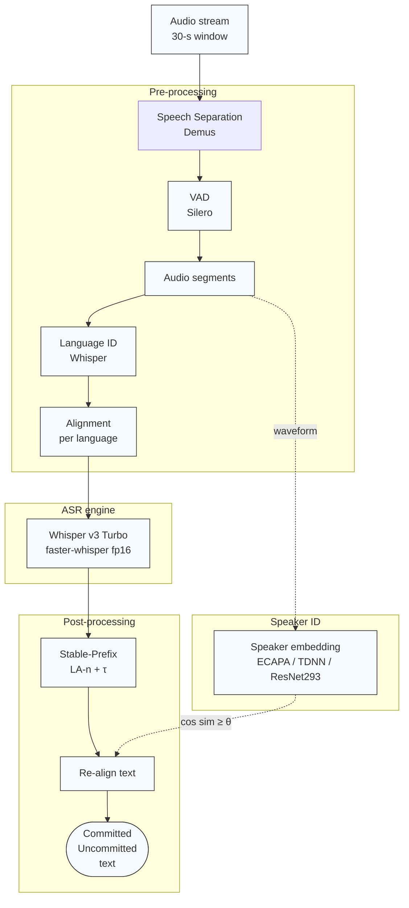

# QuickNotebookAI
# Daily-AI-Papers---VN-

```mermaid

flowchart TD
    %% ========== INPUT ======================================================
    A["Audio stream<br/>30-s window"]

    %% ========== PRE-PROCESSING ============================================
    subgraph "Pre-processing"
        direction TB
        Z["Speech Separation<br/>Demus"]
        B["VAD<br/>Silero"]
        C["Audio segments"]
        D["Language ID<br/>Whisper"]
        E["Alignment<br/>per language"]
    end

    %% ========== ASR ENGINE =================================================
    subgraph "ASR engine"
        F["Whisper v3 Turbo<br/>faster-whisper fp16"]
    end

    %% ========== POST-PROCESSING ===========================================
    subgraph "Post-processing"
        direction TB
        G["Stable-Prefix<br/>LA-n + τ"]
        R["Re-align text"]
        OUT(["Committed<br/>Uncommitted<br/>text"])
    end

    %% ========== SPEAKER-ID PATH ===========================================
    subgraph "Speaker ID"
        S["Speaker embedding<br/>ECAPA / TDNN / ResNet293"]
    end

    %% ----------------- MAIN FLOW ------------------------------------------
    A --> Z --> B --> C --> D --> E --> F --> G --> R --> OUT

    %% ----------------- SPEAKER SIDE FLOW ----------------------------------
    C -. waveform .-> S
    S -. "cos sim ≥ θ" .-> R

    %% ========== OPTIONAL STYLE (pastel boxes) =============================
    classDef blk fill:#F6FBFF,stroke:#333,stroke-width:1px;
    class A,B,C,D,E,F,G,R,S,OUT blk;


```
